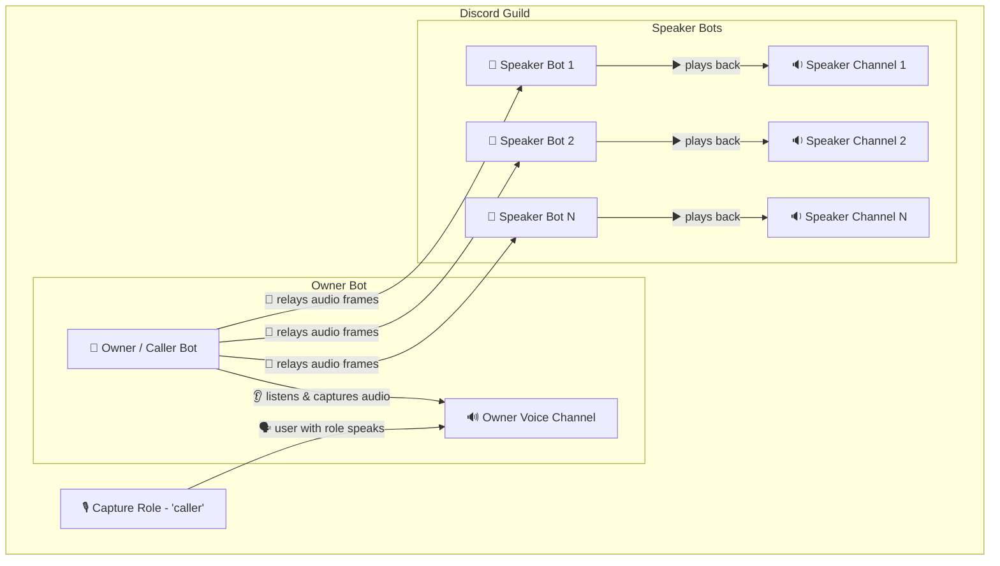
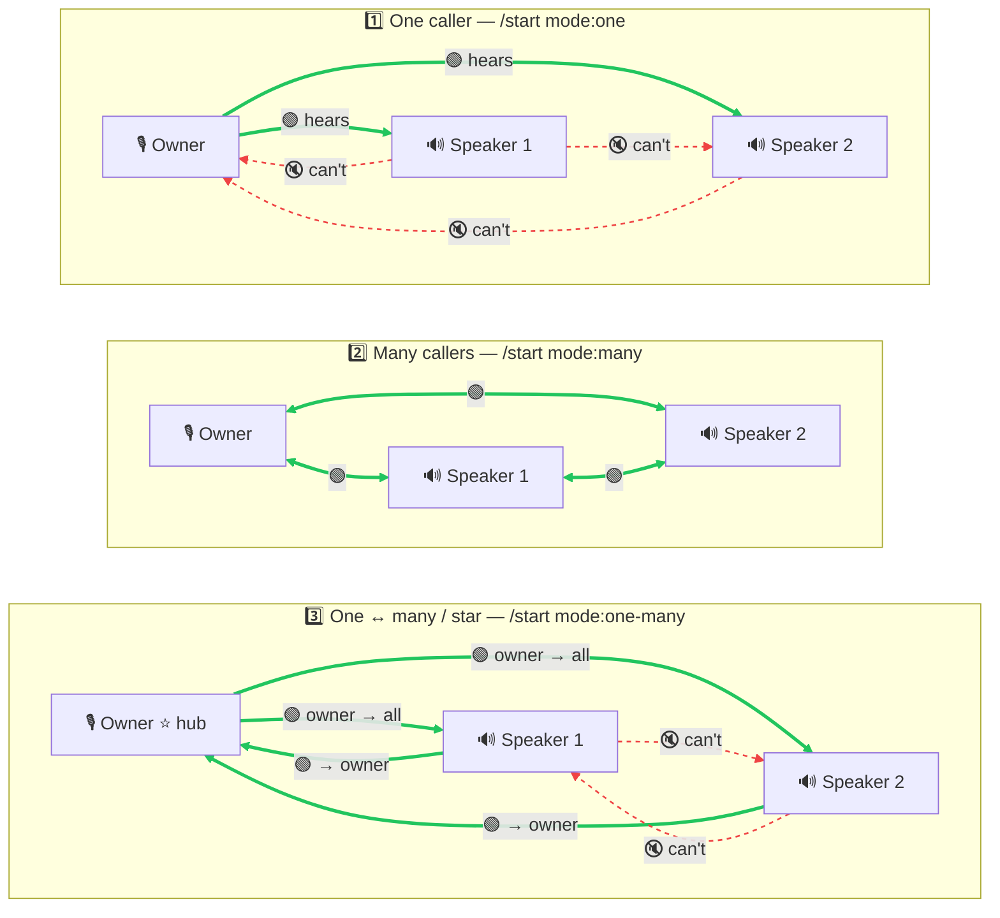

# go-discord-caller

A Go Discord bot that captures voice audio and relays it live to every bound speaker bot — across one or multiple Discord servers simultaneously. Supports single-caller broadcast and full multi-channel conference modes with mix-minus audio mixing.

If this project is useful to you, please consider giving it a ⭐ on GitHub — it helps others discover the project and motivates continued development.

[](https://github.com/sealbro/go-discord-caller)
[](https://github.com/sealbro/go-discord-caller/)
[](https://hub.docker.com/r/sealbro/go-discord-caller/)
[](https://discord.com/oauth2/authorize?client_id=1484911601210495038&scope=bot&permissions=391565762894144)

## Try it out

Want to see it in action without hosting anything? Click the **Try the bot** badge above to invite a hosted owner bot to your server, then follow [Discord app setup → step 2](#2-finish-the-bot-setup) to bind roles and add **one speaker bot** via `/setup`. A single speaker is enough to verify the relay end-to-end.

> The hosted instance is intended for evaluation. For production use, self-host with your own owner + speaker bot tokens.

## How it works

[Voice Flow](docs/VOICE_FLOW.md) – detailed signal flow and component interaction diagrams



The diagram above shows the default **one-caller** mode. The system uses **two types of Discord bots**:

| Role                   | Description                                                                                                                                                                                                             |
|------------------------|-------------------------------------------------------------------------------------------------------------------------------------------------------------------------------------------------------------------------|
| **Owner / Caller bot** | The main bot. It listens in a voice channel, captures audio from users with the configured capture role, and fans it out to all speaker bots.                                                                           |
| **Speaker bots**       | A pool of secondary bots. In default mode each speaker joins its bound channel and plays back relayed audio. In **many-callers** mode (`/start mode:many`) speakers also capture audio, enabling full conference relay. |

All speaker gateways are pre-connected at startup. When a voice raid is started, the owner bot joins its channel, every enabled speaker joins theirs, and audio is streamed in real time via [disgo](https://github.com/disgoorg/disgo) + [godave / libdave](https://github.com/disgoorg/godave) (Discord's DAVE E2EE audio protocol).

### Caller modes

Who hears who depends on the mode (🟢 solid = can hear, 🔇 red dashed = cannot hear).



- **1️⃣ One caller** — the owner talks, speakers only listen and can't talk back.
- **2️⃣ Many callers** — full conference: everyone hears everyone (mix-minus echo prevention).
- **3️⃣ One ↔ many / star** — the owner is the hub: it hears all speakers, but each speaker only hears the owner, not each other.

## Features

- **Multi-speaker relay** – unlimited speaker bots, each bound to a different voice channel
- **Three caller modes** 
  - default one-caller broadcast (`/start`) or single-caller broadcast (`/start mode:one`) where only the designated caller is captured,
  - hub-and-spoke broadcast (`/start mode:one-many`) where speakers only hear the owner,
  - full multi-channel conference (`/start mode:many`) where every bound channel captures and plays back audio with mix-minus echo prevention
- **Automatic audio pause** – bots stop processing audio for channels with no active listeners, reducing idle resource usage
- **Inter-guild relay** – guest guilds join a host session via relay code; guests are listener-only by default, or active participants with `mode:many`
- **Persistent relay codes** – each guild has a unique 8-character code stored in YAML; shared via `/status` so other servers can join
- **Per-guild configuration** – capture role, manager role, owner channel, and per-speaker bindings are stored per guild and survive restarts
- **Interactive setup UI** – paginated slash-command menus with dropdowns, toggle buttons, and quick page-range navigation; no manual config file needed
- **Role-based access control** – a dedicated manager role controls who can start/stop raids without granting full admin
- **Auto-seeding** – speaker bots already in a guild are automatically registered on startup or when they join later
- **Speaker gateway watchdog** – reconnects any speaker gateway that failed at startup; logs health every 30 s
- **Localization** – slash-command descriptions and the setup UI are translated into 7 languages (English, Español, Deutsch, Français, Português, Polski, Русский); the language is auto-detected from each user's Discord client locale and can be pinned per guild from `/setup`

## Slash commands

> The manager role is configured inside `/setup`. `/status` is available to everyone.

| Command                        | Required role | Description                                                                                                                                       |
|--------------------------------|---------------|---------------------------------------------------------------------------------------------------------------------------------------------------|
| `/setup`                       | Administrator | Open the interactive setup panel (capture role, manager role, owner-channel picker, speaker binder, language)                                     |
| `/start`                       | Manager       | Start a voice raid in **one-caller** mode — only the designated caller is captured; speakers play back in listen-only                             |
| `/start mode:one-many`         | Manager       | Start a voice raid in **hub-and-spoke** mode — the owner hears all speakers, but speakers only hear the owner; prevents cross-talk in large raids |
| `/start mode:many`             | Manager       | Start a voice raid in **many-callers** mode — every bound channel captures and plays back audio with mix-minus echo prevention                    |
| `/start code:XXXXXX`           | Manager       | Join an existing relay session as a **listener** — receives host audio but does not capture locally                                               |
| `/start code:XXXXXX mode:many` | Manager       | Join an existing relay session as an **active participant** — also captures local audio (only effective when host uses `mode:many`)               |
| `/stop`                        | Manager       | Stop the active voice raid and make all speakers leave their channels                                                                             |
| `/status`                      | Everyone      | Show the current capture role, manager role, owner channel, speaker bindings, relay code, and session state                                       |

## Inter-guild relay

Each guild has a persistent **relay code** (8-character, e.g. `A3BX7KQP`) shown in `/status`.

**To start a cross-guild relay:**

1. Guild A runs `/start` (or `/start mode:many`) — its session becomes active; the relay code is visible in `/status`.
2. Guild B runs `/start code:A3BX7KQP` — its speakers connect in **listener-only** mode and receive all audio from Guild A.
3. To have Guild B's users also heard in Guild A, Guild A must use `mode:many` and Guild B must join with `/start code:A3BX7KQP mode:many`.
4. When Guild A runs `/stop`, all guest sessions are torn down automatically.

## Configuration

Configuration is loaded from environment variables (a `.env` file in the working directory is also supported via [godotenv](https://github.com/joho/godotenv)).

| Variable                      | Required | Description                                                                                             |
|-------------------------------|----------|---------------------------------------------------------------------------------------------------------|
| `DISCORD_OWNER_BOT_TOKEN`     | ✅        | Token for the owner / caller bot                                                                        |
| `DISCORD_SPEAKER_BOT_TOKEN_1` | ⚠️       | Token for the first speaker bot                                                                         |
| `DISCORD_SPEAKER_BOT_TOKEN_2` | ⚠️       | Token for the second speaker bot                                                                        |
| `DISCORD_SPEAKER_BOT_TOKEN_N` | ⚠️       | … any numeric suffix; gaps in numbering are supported                                                   |
| `SESSION_IDLE_TIMEOUT`        | ❌        | How long a voice raid may stay continuously idle (default: `10m`; set `0` to disable)                   |
| `STORE_PATH`                  | ❌        | Path to the YAML persistence file (default: `store.yaml`)                                               |
| `OTEL_ENDPOINT`               | ❌        | OTLP gRPC endpoint for traces, metrics, and logs (e.g. `alloy:4317`); empty or unset disables telemetry |
| `LOG_LEVEL`                   | ❌        | Minimum log level: `debug`, `info`, `warn`, `error` (default: `info`)                                   |

> At least one speaker token is strongly recommended; without any, voice relay will not work.

## Discord app setup

### 1. Create the bots and start the service

For each bot (owner first, then one per speaker) go to [https://discord.com/developers/applications](https://discord.com/developers/applications), click **New Application**, give it a name, set a profile image and banner.

Then open the **Bot** section:
- Click **Reset Token**, copy and save it — you won't see it again
- **Owner bot only:** enable **Server Members Intent** under *Privileged Gateway Intents*

Add all tokens to your `.env`:

```env
DISCORD_OWNER_BOT_TOKEN=your-owner-token
DISCORD_SPEAKER_BOT_TOKEN_1=your-speaker-1-token
DISCORD_SPEAKER_BOT_TOKEN_2=your-speaker-2-token
```

Start the service (see [Running locally](#running-locally) or [Docker](#docker)).

To invite the **owner bot** to your server, open the **Installation** section, copy the Install Link and append the required scope and permissions:

```
https://discord.com/oauth2/authorize?client_id=<client_id>&scope=bot&permissions=391565762894144
```

> The ready-to-use invite URL is also printed to the logs automatically when the bot starts (`owner bot invite URL`).

> Speaker bots do **not** need to be added to the server manually — use the `/setup` command after the bot is running to invite them one by one.

### 2. Finish the bot setup

1. In your Discord server, run `/setup` to open the interactive panel:
   - Bind the **capture role** — members with this role will have their voice relayed
   - Bind the **manager role** — members with this role can use `/start` and `/stop`
   - Bind the **owner bot** to a voice channel
   - Add speaker bots via the **Add Speaker** button and bind each to a voice channel
   - Optionally pin a **language** for the server (otherwise each user sees their own Discord client language)
2. Run `/start` to begin a voice raid.
3. Share your relay code (from `/status`) with another server so they can join with `/start code:XXXXXX`.

---

## Running locally

```bash
go run ./cmd/bot
```

> **Dependencies:** the bot links against [libdave](https://github.com/disgoorg/godave) (CGO). Make sure `libdave` is installed and `PKG_CONFIG_PATH` points to its `.pc` file. See the Dockerfile for a reference install script.

## Docker

### Pull from Docker Hub

```bash
# Pull and run (recommended)
docker run -d \
  --env-file .env \
  -e STORE_PATH=/data/store.yaml \
  -v $(pwd)/data:/data \
  sealbro/go-discord-caller
```

The YAML store is mounted from `./data/store.yaml` on the host so bindings survive container restarts.

Individual env variables can be passed with `-e` instead of `--env-file`:

```bash
docker run -d \
  -e DISCORD_OWNER_BOT_TOKEN=your-owner-token \
  -e DISCORD_SPEAKER_BOT_TOKEN_1=your-speaker-1-token \
  -e STORE_PATH=/data/store.yaml \
  -v $(pwd)/data:/data \
  sealbro/go-discord-caller
```

### Build locally

```bash
docker build -t go-discord-caller .

docker run -d --env-file .env go-discord-caller
```

The multi-stage build installs `libdave`, compiles the binary with CGO, then copies the binary and all shared-library dependencies into a minimal `distroless/base` image.

## Tech stack

- [disgo](https://github.com/disgoorg/disgo) – Discord API & gateway client
- [godave / libdave](https://github.com/disgoorg/godave) – Discord DAVE E2EE voice protocol (CGO)
- [godotenv](https://github.com/joho/godotenv) – `.env` file loading
- [OpenTelemetry Go](https://opentelemetry.io/docs/languages/go/) – traces, metrics, and logs via OTLP gRPC

## Articles

- [Building a Discord Caller (Voice Relay) Bot in Go](https://dev.to/sealbro/building-a-discord-caller-voice-relay-bot-in-go-5b9h)

## Changelog

See [CHANGELOG.md](CHANGELOG.md) for the full release history.
