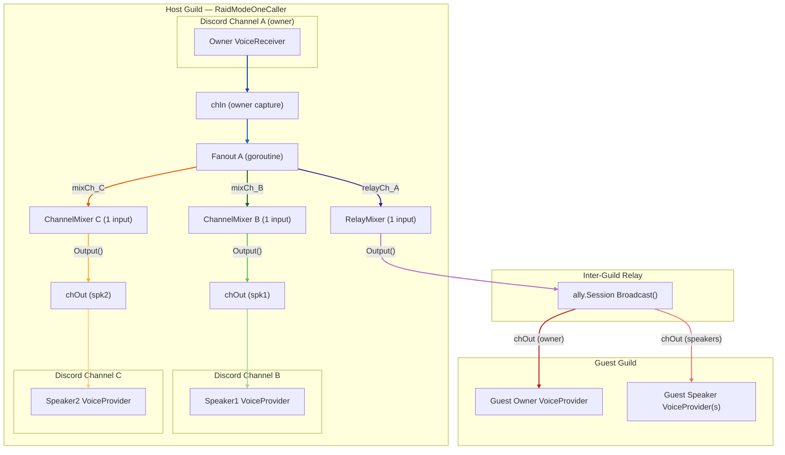

# Voice Session Flow

---

## RaidModeOneCaller — owner capture only

Only the owner bot has a `VoiceReceiver`. Speakers are `VoiceProvider`-only.
Single source → no mix-minus needed → each `ChannelMixer` has exactly one input.
`chOwnerOut` is **not** created (owner does not play back audio into its own channel).

---

## RaidModeGuildCaller — all channels capture and relay

Every channel has both a `VoiceReceiver` (capture) and a `VoiceProvider` (playback).
Each `ChannelMixer` receives audio from all sources **except its own channel** (mix-minus).
The owner bot also gets `chOwnerOut` so it plays back the mixed audio of other channels.

```mermaid
flowchart TD
    subgraph HOST_GUILD["Host Guild — RaidModeGuildCaller"]
        subgraph ChA["Discord Channel A"]
            OwnerVR["Owner VoiceReceiver"]
            OwnerVP["Owner VoiceProvider"]
        end
        subgraph ChB["Discord Channel B"]
            Spk1VR["Speaker1 VoiceReceiver"]
            Spk1VP["Speaker1 VoiceProvider"]
        end
        subgraph ChC["Discord Channel C"]
            Spk2VR["Speaker2 VoiceReceiver"]
            Spk2VP["Speaker2 VoiceProvider"]
        end

        chIn["chIn (owner capture)"]
        chCaptureB["chCapture (spk1 capture)"]
        chCaptureC["chCapture (spk2 capture)"]

        OwnerVR --> chIn
        Spk1VR --> chCaptureB
        Spk2VR --> chCaptureC

        FanA["Fanout A (goroutine)"]
        FanB["Fanout B (goroutine)"]
        FanC["Fanout C (goroutine)"]

        chIn       --> FanA
        chCaptureB --> FanB
        chCaptureC --> FanC

        MixA["ChannelMixer A (mix-minus Ch A)"]
        MixB["ChannelMixer B (mix-minus Ch B)"]
        MixC["ChannelMixer C (mix-minus Ch C)"]
        RelayMix["RelayMixer (all sources)"]

        %% Fanout A feeds all channel mixers except A (mix-minus) and relay
        FanA -- "mixCh_B" --> MixB
        FanA -- "mixCh_C" --> MixC
        FanA -- "relayCh_A" --> RelayMix

        %% Fanout B skips MixB (mix-minus)
        FanB -- "mixCh_A" --> MixA
        FanB -- "mixCh_C" --> MixC
        FanB -- "relayCh_B" --> RelayMix

        %% Fanout C skips MixC (mix-minus)
        FanC -- "mixCh_A" --> MixA
        FanC -- "mixCh_B" --> MixB
        FanC -- "relayCh_C" --> RelayMix

        chOwnerOut["chOwnerOut"]
        chOutB["chOut (spk1)"]
        chOutC["chOut (spk2)"]

        MixA -- "Output()" --> chOwnerOut
        MixB -- "Output()" --> chOutB
        MixC -- "Output()" --> chOutC

        chOwnerOut --> OwnerVP
        chOutB     --> Spk1VP
        chOutC     --> Spk2VP
    end

    subgraph RELAY["Inter-Guild Relay"]
        AllySession["ally.Session Broadcast()"]
        RelayMix -- "Output()" --> AllySession
    end

    subgraph GUEST_GUILD["Guest Guild"]
        GuestOwnerVP["Guest Owner VoiceProvider"]
        GuestSpkVP["Guest Speaker VoiceProvider(s)"]
        AllySession -- "chOut (owner)"   --> GuestOwnerVP
        AllySession -- "chOut (speakers)"--> GuestSpkVP
    end

    %% link indices (0-based, in definition order):
    %%  0-2   : VoiceReceiver → capture channel   (blue)
    %%  3-5   : capture channel → fanout           (cyan)
    %%  6,7   : FanA → ChannelMixer B/C            (green)
    %%  8     : FanA → RelayMixer                  (orange)
    %%  9,10  : FanB → ChannelMixer A/C            (green)
    %%  11    : FanB → RelayMixer                  (orange)
    %%  12,13 : FanC → ChannelMixer A/B            (green)
    %%  14    : FanC → RelayMixer                  (orange)
    %%  15-17 : ChannelMixer → chOut               (purple)
    %%  18-20 : chOut → VoiceProvider              (pink)
    %%  21    : RelayMixer → AllySession            (orange)
    %%  22-23 : AllySession → Guest VoiceProviders (red)

    %% Channel A (Owner) — blue shades, dark→light: capture in, mix inputs, mix out, provider
    linkStyle 0  stroke:#0d47a1,stroke-width:2px
    linkStyle 3  stroke:#1565c0,stroke-width:2px
    linkStyle 9  stroke:#1976d2,stroke-width:2px
    linkStyle 12 stroke:#1e88e5,stroke-width:2px
    linkStyle 15 stroke:#42a5f5,stroke-width:2px
    linkStyle 18 stroke:#90caf9,stroke-width:2px

    %% Channel B (Speaker1) — green shades, dark→light
    linkStyle 1  stroke:#1b5e20,stroke-width:2px
    linkStyle 4  stroke:#2e7d32,stroke-width:2px
    linkStyle 6  stroke:#388e3c,stroke-width:2px
    linkStyle 13 stroke:#43a047,stroke-width:2px
    linkStyle 16 stroke:#66bb6a,stroke-width:2px
    linkStyle 19 stroke:#a5d6a7,stroke-width:2px

    %% Channel C (Speaker2) — orange shades, dark→light
    linkStyle 2  stroke:#e65100,stroke-width:2px
    linkStyle 5  stroke:#ef6c00,stroke-width:2px
    linkStyle 7  stroke:#f57c00,stroke-width:2px
    linkStyle 10 stroke:#fb8c00,stroke-width:2px
    linkStyle 17 stroke:#ffa726,stroke-width:2px
    linkStyle 20 stroke:#ffcc80,stroke-width:2px

    %% Relay path — purple shades
    linkStyle 8  stroke:#4a148c,stroke-width:2px
    linkStyle 11 stroke:#6a1b9a,stroke-width:2px
    linkStyle 14 stroke:#8e24aa,stroke-width:2px
    linkStyle 21 stroke:#ba68c8,stroke-width:2px

    %% Guest delivery — red shades
    linkStyle 22 stroke:#b71c1c,stroke-width:2px
    linkStyle 23 stroke:#e57373,stroke-width:2px
```

---

## RaidModeGuildCaller + RaidModeAllyCaller — bi-directional inter-guild relay (PLANNED)

> **Not yet implemented.** Two blockers prevent this mode from working:
>
> 1. **Workaround in `JoinSession`** (line 95–99): all guests are force-downgraded to
>    `RaidModeAllyListener`, so no guest capture or `BroadcastFromGuild` ever runs.
> 2. **Host never registers with `ally.Session`**: `StartVoiceRaid` never calls
>    `allySession.AddGuild(hostGuildID, ...)`, so `BroadcastFromGuild` has no host
>    targets to deliver to even if the workaround were removed.
>
> Until both are fixed, the actual behaviour matches section 2: host relays to guests,
> guests are listeners only — regardless of the mode selected by the guest.

The diagram below shows the **intended** design once both blockers are resolved.
Dashed lines mark the two currently-missing wiring paths.

```mermaid
flowchart TD
    subgraph HOST["Host Guild — RaidModeGuildCaller"]
        subgraph HChA["Channel A (owner)"]
            HOwnerVR["Owner VoiceReceiver"]
            HOwnerVP["Owner VoiceProvider"]
        end
        subgraph HChB["Channel B"]
            HSpkVR["Speaker VoiceReceiver"]
            HSpkVP["Speaker VoiceProvider"]
        end

        HchIn["chIn"]
        HchCap["chCapture"]
        HFanA["Fanout A (goroutine)"]
        HFanB["Fanout B (goroutine)"]
        HMixA["ChannelMixer A (mix-minus)"]
        HMixB["ChannelMixer B (mix-minus)"]
        HRelayMix["RelayMixer"]
        HchOwnerOut["chOwnerOut"]
        HchOut["chOut (spk)"]

        HOwnerVR --> HchIn  --> HFanA
        HSpkVR   --> HchCap --> HFanB

        HFanA -- "mixCh_B"   --> HMixB
        HFanA -- "relayCh_A" --> HRelayMix
        HFanB -- "mixCh_A"   --> HMixA
        HFanB -- "relayCh_B" --> HRelayMix

        HMixA -- "Output()" --> HchOwnerOut --> HOwnerVP
        HMixB -- "Output()" --> HchOut      --> HSpkVP
    end

    subgraph SESSION["ally.Session (relay hub)"]
        Broadcast["Broadcast()"]
        BroadcastFrom["BroadcastFromGuild()"]
    end

    HRelayMix -- "Output()" --> Broadcast

    subgraph GUEST["Guest Guild — RaidModeAllyCaller"]
        subgraph GChB["Channel B"]
            GSpkVR["Speaker VoiceReceiver ⚠ blocked by workaround"]
            GSpkVP["Speaker VoiceProvider"]
        end
        GOwnerVP["Guest Owner VoiceProvider"]

        GchCap["chCapture"]
        GDedup["iterDeduplicatedCaptures"]
        GchOut["chOut (spk)"]
        GchOwnerOut["chOut (owner)"]

        GSpkVR -. "workaround: capture disabled" .-> GchCap
        GchCap --> GDedup
        GchOut      --> GSpkVP
        GchOwnerOut --> GOwnerVP
    end

    GDedup        -. "blocked: no guest capture" .-> BroadcastFrom
    Broadcast     -- "to guest spk outs"  --> GchOut
    Broadcast     -- "to guest owner out" --> GchOwnerOut
    BroadcastFrom -. "blocked: host not in AddGuild" .-> HchOut
    BroadcastFrom -. "blocked: host not in AddGuild" .-> HchOwnerOut

    %% link indices:
    %%  0  : HOwnerVR → HchIn
    %%  1  : HchIn → HFanA
    %%  2  : HSpkVR → HchCap         (dashed — workaround)
    %%  3  : HchCap → HFanB
    %%  4  : HFanA → HMixB
    %%  5  : HFanA → HRelayMix
    %%  6  : HFanB → HMixA
    %%  7  : HFanB → HRelayMix
    %%  8  : HMixA → HchOwnerOut
    %%  9  : HchOwnerOut → HOwnerVP
    %%  10 : HMixB → HchOut
    %%  11 : HchOut → HSpkVP
    %%  12 : HRelayMix → Broadcast
    %%  13 : GSpkVR → GchCap         (dashed — workaround)
    %%  14 : GchCap → GDedup
    %%  15 : GchOut → GSpkVP
    %%  16 : GchOwnerOut → GOwnerVP
    %%  17 : GDedup → BroadcastFrom  (dashed — blocked)
    %%  18 : Broadcast → GchOut
    %%  19 : Broadcast → GchOwnerOut
    %%  20 : BroadcastFrom → HchOut  (dashed — blocked)
    %%  21 : BroadcastFrom → HchOwnerOut (dashed — blocked)

    %% Host Ch A (owner) — blue shades, dark→light
    linkStyle 0  stroke:#0d47a1,stroke-width:2px
    linkStyle 1  stroke:#1565c0,stroke-width:2px
    linkStyle 6  stroke:#1976d2,stroke-width:2px
    linkStyle 8  stroke:#42a5f5,stroke-width:2px
    linkStyle 9  stroke:#90caf9,stroke-width:2px

    %% Host Ch B (speaker) — green shades, dark→light
    linkStyle 3  stroke:#2e7d32,stroke-width:2px
    linkStyle 4  stroke:#388e3c,stroke-width:2px
    linkStyle 10 stroke:#66bb6a,stroke-width:2px
    linkStyle 11 stroke:#a5d6a7,stroke-width:2px

    %% Host relay path — purple shades
    linkStyle 5  stroke:#4a148c,stroke-width:2px
    linkStyle 7  stroke:#6a1b9a,stroke-width:2px
    linkStyle 12 stroke:#ba68c8,stroke-width:2px

    %% Guest capture path (blocked) — grey dashed
    linkStyle 2  stroke:#999,stroke-width:1px,stroke-dasharray:4
    linkStyle 13 stroke:#999,stroke-width:1px,stroke-dasharray:4
    linkStyle 14 stroke:#ef6c00,stroke-width:2px
    linkStyle 17 stroke:#999,stroke-width:1px,stroke-dasharray:4

    %% Host → Guest broadcast — teal shades
    linkStyle 18 stroke:#00695c,stroke-width:2px
    linkStyle 19 stroke:#26a69a,stroke-width:2px

    %% Guest → Host broadcast (blocked) — grey dashed
    linkStyle 20 stroke:#999,stroke-width:1px,stroke-dasharray:4
    linkStyle 21 stroke:#999,stroke-width:1px,stroke-dasharray:4

    %% Guest provider outputs — red shades
    linkStyle 15 stroke:#b71c1c,stroke-width:2px
    linkStyle 16 stroke:#e57373,stroke-width:2px
```

### What needs to be wired to enable AllyCaller

| Fix | Location | What to do |
|-----|----------|------------|
| Remove guest listener workaround | `JoinSession` line 95–99 | Uncomment original downgrade logic; remove forced `RaidModeAllyListener` |
| Register host outputs with session | `StartVoiceRaid` | After `wireFanout`, call `allySession.AddGuild(guildID, allHostOuts)` so `BroadcastFromGuild` can deliver to host speakers |

---

## Mix-minus rule

Each `ChannelMixer[X]` receives audio from **every source except sources originating in channel X**.
This prevents echo: users in channel X would otherwise hear their own audio played back to them.

## Data flow summary

| Stage            | Component                              | Description                                                                   |
|------------------|----------------------------------------|-------------------------------------------------------------------------------|
| Capture          | `VoiceReceiver` → `chIn` / `chCapture`| Role-filtered Opus frames from Discord                                        |
| Fanout           | goroutine per source                   | Copies each packet to all registered mixer input channels                     |
| Per-channel mix  | `ChannelMixer[X]`                      | Mixes all foreign sources; output drives speaker `VoiceProvider`s in channel X|
| Relay mix        | `RelayMixer`                           | Mixes all sources; output is broadcast to every attached guest guild          |
| Host → Guest     | `ally.Session.Broadcast`               | Sends relay packets to ALL registered guest speaker + owner output channels   |
| Guest → others   | `ally.Session.BroadcastFromGuild`      | (Planned) Sends guest-captured audio to all guilds except the originating one |
