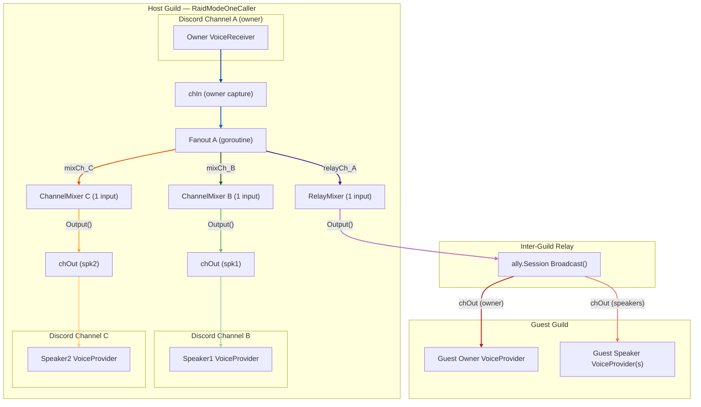
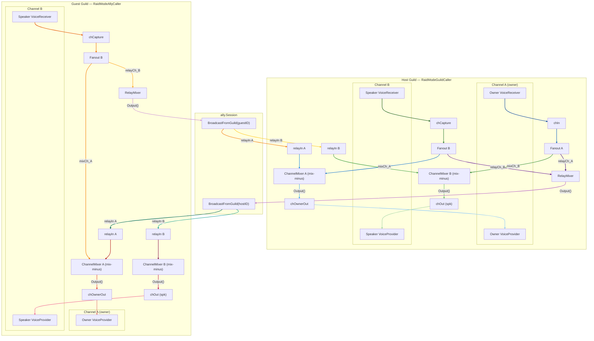

# Voice Session Flow

---

## RaidModeOneCaller — owner capture only

Only the owner bot has a `VoiceReceiver`. Speakers are `VoiceProvider`-only.
Single source → no mix-minus needed → each `ChannelMixer` has exactly one input.
`chOwnerOut` is **not** created (owner does not play back audio into its own channel).

---

## RaidModeGuildCaller — all channels capture and relay

Every channel has both a `VoiceReceiver` (capture) and a `VoiceProvider` (playback).
Each `ChannelMixer` receives audio from all sources **except its own channel** (mix-minus).
The owner bot also gets `chOwnerOut` so it plays back the mixed audio of other channels.

```mermaid
flowchart TD
    subgraph HOST_GUILD["Host Guild — RaidModeGuildCaller"]
        subgraph ChA["Discord Channel A"]
            OwnerVR["Owner VoiceReceiver"]
            OwnerVP["Owner VoiceProvider"]
        end
        subgraph ChB["Discord Channel B"]
            Spk1VR["Speaker1 VoiceReceiver"]
            Spk1VP["Speaker1 VoiceProvider"]
        end
        subgraph ChC["Discord Channel C"]
            Spk2VR["Speaker2 VoiceReceiver"]
            Spk2VP["Speaker2 VoiceProvider"]
        end

        chIn["chIn (owner capture)"]
        chCaptureB["chCapture (spk1 capture)"]
        chCaptureC["chCapture (spk2 capture)"]

        OwnerVR --> chIn
        Spk1VR --> chCaptureB
        Spk2VR --> chCaptureC

        FanA["Fanout A (goroutine)"]
        FanB["Fanout B (goroutine)"]
        FanC["Fanout C (goroutine)"]

        chIn       --> FanA
        chCaptureB --> FanB
        chCaptureC --> FanC

        MixA["ChannelMixer A (mix-minus Ch A)"]
        MixB["ChannelMixer B (mix-minus Ch B)"]
        MixC["ChannelMixer C (mix-minus Ch C)"]
        RelayMix["RelayMixer (all sources)"]

        %% Fanout A feeds all channel mixers except A (mix-minus) and relay
        FanA -- "mixCh_B" --> MixB
        FanA -- "mixCh_C" --> MixC
        FanA -- "relayCh_A" --> RelayMix

        %% Fanout B skips MixB (mix-minus)
        FanB -- "mixCh_A" --> MixA
        FanB -- "mixCh_C" --> MixC
        FanB -- "relayCh_B" --> RelayMix

        %% Fanout C skips MixC (mix-minus)
        FanC -- "mixCh_A" --> MixA
        FanC -- "mixCh_B" --> MixB
        FanC -- "relayCh_C" --> RelayMix

        chOwnerOut["chOwnerOut"]
        chOutB["chOut (spk1)"]
        chOutC["chOut (spk2)"]

        MixA -- "Output()" --> chOwnerOut
        MixB -- "Output()" --> chOutB
        MixC -- "Output()" --> chOutC

        chOwnerOut --> OwnerVP
        chOutB     --> Spk1VP
        chOutC     --> Spk2VP
    end

    subgraph RELAY["Inter-Guild Relay"]
        AllySession["ally.Session Broadcast()"]
        RelayMix -- "Output()" --> AllySession
    end

    subgraph GUEST_GUILD["Guest Guild"]
        GuestOwnerVP["Guest Owner VoiceProvider"]
        GuestSpkVP["Guest Speaker VoiceProvider(s)"]
        AllySession -- "chOut (owner)"   --> GuestOwnerVP
        AllySession -- "chOut (speakers)"--> GuestSpkVP
    end

    %% link indices (0-based, in definition order):
    %%  0-2   : VoiceReceiver → capture channel   (blue)
    %%  3-5   : capture channel → fanout           (cyan)
    %%  6,7   : FanA → ChannelMixer B/C            (green)
    %%  8     : FanA → RelayMixer                  (orange)
    %%  9,10  : FanB → ChannelMixer A/C            (green)
    %%  11    : FanB → RelayMixer                  (orange)
    %%  12,13 : FanC → ChannelMixer A/B            (green)
    %%  14    : FanC → RelayMixer                  (orange)
    %%  15-17 : ChannelMixer → chOut               (purple)
    %%  18-20 : chOut → VoiceProvider              (pink)
    %%  21    : RelayMixer → AllySession            (orange)
    %%  22-23 : AllySession → Guest VoiceProviders (red)

    %% Channel A (Owner) — blue shades, dark→light: capture in, mix inputs, mix out, provider
    linkStyle 0  stroke:#0d47a1,stroke-width:2px
    linkStyle 3  stroke:#1565c0,stroke-width:2px
    linkStyle 9  stroke:#1976d2,stroke-width:2px
    linkStyle 12 stroke:#1e88e5,stroke-width:2px
    linkStyle 15 stroke:#42a5f5,stroke-width:2px
    linkStyle 18 stroke:#90caf9,stroke-width:2px

    %% Channel B (Speaker1) — green shades, dark→light
    linkStyle 1  stroke:#1b5e20,stroke-width:2px
    linkStyle 4  stroke:#2e7d32,stroke-width:2px
    linkStyle 6  stroke:#388e3c,stroke-width:2px
    linkStyle 13 stroke:#43a047,stroke-width:2px
    linkStyle 16 stroke:#66bb6a,stroke-width:2px
    linkStyle 19 stroke:#a5d6a7,stroke-width:2px

    %% Channel C (Speaker2) — orange shades, dark→light
    linkStyle 2  stroke:#e65100,stroke-width:2px
    linkStyle 5  stroke:#ef6c00,stroke-width:2px
    linkStyle 7  stroke:#f57c00,stroke-width:2px
    linkStyle 10 stroke:#fb8c00,stroke-width:2px
    linkStyle 17 stroke:#ffa726,stroke-width:2px
    linkStyle 20 stroke:#ffcc80,stroke-width:2px

    %% Relay path — purple shades
    linkStyle 8  stroke:#4a148c,stroke-width:2px
    linkStyle 11 stroke:#6a1b9a,stroke-width:2px
    linkStyle 14 stroke:#8e24aa,stroke-width:2px
    linkStyle 21 stroke:#ba68c8,stroke-width:2px

    %% Guest delivery — red shades
    linkStyle 22 stroke:#b71c1c,stroke-width:2px
    linkStyle 23 stroke:#e57373,stroke-width:2px
```

---

## RaidModeGuildCaller + RaidModeAllyCaller — bi-directional inter-guild relay

Both guilds have a full mix-minus graph. Both use `BroadcastFromGuild` so neither
hears its own audio echoed back. `registerRelayInputs` wires relay inputs into each
guild's `ChannelMixer`s so incoming relay audio is mixed alongside local sources.

- **Host → Guest**: `RelayMixer` → `BroadcastFromGuild(hostID)` → guest `relayIn` channels → guest `ChannelMixer`s
- **Guest → Host**: guest `RelayMixer` → `BroadcastFromGuild(guestID)` → host `relayIn` channels → host `ChannelMixer`s

---

## Mix-minus rule

Each `ChannelMixer[X]` receives audio from **every source except sources originating in channel X**.
This prevents echo: users in channel X would otherwise hear their own audio played back to them.

## Data flow summary

| Stage            | Component                              | Description                                                                   |
|------------------|----------------------------------------|-------------------------------------------------------------------------------|
| Capture          | `VoiceReceiver` → `chIn` / `chCapture`| Role-filtered Opus frames from Discord                                        |
| Fanout           | goroutine per source                   | Copies each packet to all registered mixer input channels                     |
| Per-channel mix  | `ChannelMixer[X]`                      | Mixes all foreign sources; output drives speaker `VoiceProvider`s in channel X|
| Relay mix        | `RelayMixer`                           | Mixes all sources; output is broadcast to every attached guest guild          |
| Guest delivery   | `ally.Session.Broadcast`               | Sends relay packets to guest speaker and owner output channels                |
