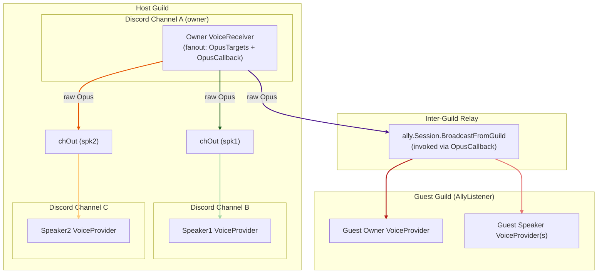
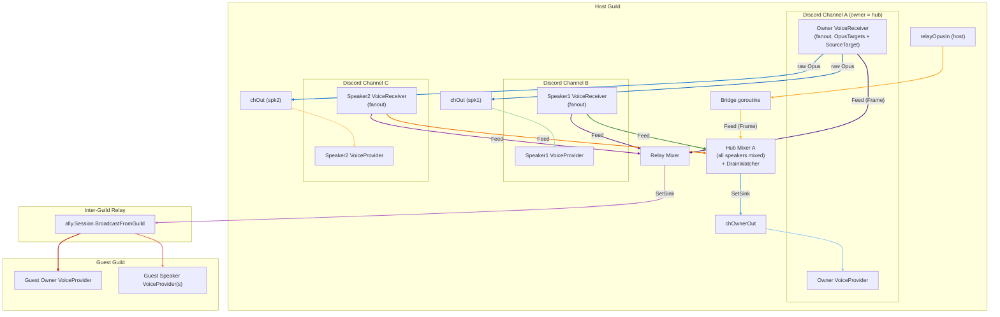
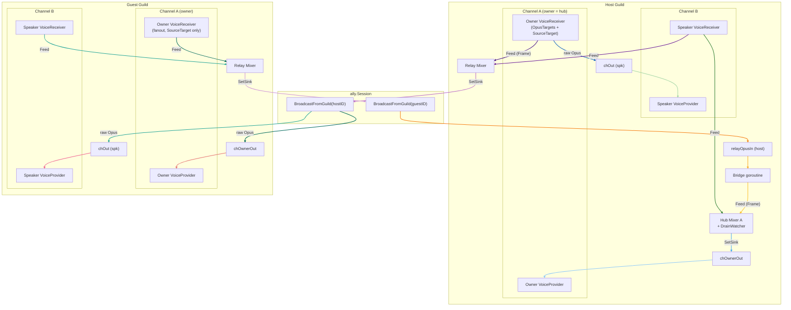

# Voice Session Flow

State as of the auto-route refactor: inline fanout decode in
`VoiceReceiver.dispatchFanout`, pull-based per-user `SourceBuffer` mixer inputs,
sink-callback mixer output. Every host and guest pipeline is router-driven —
the `sourceRouter` (`internal/manager/auto_route.go`) owns mode (off/copy/mix)
selection AND mixer pause state. The diagrams below show the **mix-mode** wire
layout for each raid mode; in copy or off mode the same source's FanoutHandle
is re-installed with a different `FanoutInstall` shape but the participating
destinations are the same.

---

## RaidModeOneCaller — single source, multiple speaker channels

Only the owner bot has a `VoiceReceiver`; speakers are `VoiceProvider`-only.
The router decides between two modes for the owner source:

- **Copy mode** (`C(owner) == 1`): owner's `FanoutHandle` is installed with
  `OpusTargets` pointing at each speaker `chOut` (raw Opus, per-target pooled
  copy) and an `OpusCallback` that calls `ally.Session.BroadcastFromGuild`.
  Both the per-channel mixers and the relay mixer are paused — owner writes
  directly to speaker chOuts and broadcasts raw Opus to the relay. No decode,
  no mix, no re-encode on the hot path.
- **Mix mode** (`C(owner) >= 2`): owner's `FanoutHandle` is installed with
  `SourceTargets` (one `SourceBuffer` per `(user, destination mixer)` pair —
  the §4.3 per-user keying fix). Per-channel mixers and the relay mixer run;
  the relay's sink calls `ally.Session.BroadcastFromGuild`.

The diagram below shows **copy mode** (the common case for OneCaller).

---

## RaidModeGuildCaller — all channels capture and relay

Every channel has both a `VoiceReceiver` (capture, fanout mode) and a `VoiceProvider` (playback).
On each Opus packet `VoiceReceiver.dispatchFanout` runs **inline on disgo's UDP goroutine**: it looks up the per-user `SourceBuffer` list keyed by the speaker's userID, decodes once, then calls `SourceBuffer.Feed` on every entry (one buffer per (user × destination mixer)). Each `Mixer.tick` pulls one frame from each input via `SourceBuffer.Pull`. There is no per-source decode goroutine.
Each `Mixer` receives audio from all sources **except its own channel** (mix-minus). The owner bot also gets `chOwnerOut` so it plays back the mixed audio of other channels.

```mermaid
flowchart TD
    subgraph HOST_GUILD["Host Guild"]
        subgraph ChA["Discord Channel A"]
            OwnerVR["Owner VoiceReceiver<br/>(fanout mode)"]
            OwnerVP["Owner VoiceProvider"]
        end
        subgraph ChB["Discord Channel B"]
            Spk1VR["Speaker1 VoiceReceiver<br/>(fanout mode)"]
            Spk1VP["Speaker1 VoiceProvider"]
        end
        subgraph ChC["Discord Channel C"]
            Spk2VR["Speaker2 VoiceReceiver<br/>(fanout mode)"]
            Spk2VP["Speaker2 VoiceProvider"]
        end

        MixA["Mixer A (mix-minus Ch A)<br/>+ DrainWatcher"]
        MixB["Mixer B (mix-minus Ch B)<br/>+ DrainWatcher"]
        MixC["Mixer C (mix-minus Ch C)<br/>+ DrainWatcher"]
        RelayMix["Relay Mixer (all sources)"]

        %% Owner source: dispatchFanout → SourceBuffer.Feed on MixB, MixC, RelayMix
        OwnerVR -- "Feed (Frame)" --> MixB
        OwnerVR -- "Feed (Frame)" --> MixC
        OwnerVR -- "Feed (Frame)" --> RelayMix

        %% Speaker1 source: → MixA, MixC, RelayMix (skip MixB)
        Spk1VR -- "Feed (Frame)" --> MixA
        Spk1VR -- "Feed (Frame)" --> MixC
        Spk1VR -- "Feed (Frame)" --> RelayMix

        %% Speaker2 source: → MixA, MixB, RelayMix (skip MixC)
        Spk2VR -- "Feed (Frame)" --> MixA
        Spk2VR -- "Feed (Frame)" --> MixB
        Spk2VR -- "Feed (Frame)" --> RelayMix

        chOwnerOut["chOwnerOut"]
        chOutB["chOut (spk1)"]
        chOutC["chOut (spk2)"]

        MixA -- "SetSink" --> chOwnerOut
        MixB -- "SetSink" --> chOutB
        MixC -- "SetSink" --> chOutC

        chOwnerOut --> OwnerVP
        chOutB --> Spk1VP
        chOutC --> Spk2VP
    end

    subgraph RELAY["Inter-Guild Relay"]
        AllySession["ally.Session.BroadcastFromGuild"]
        RelayMix -- "SetSink" --> AllySession
    end

    subgraph GUEST_GUILD["Guest Guild"]
        GuestOwnerVP["Guest Owner VoiceProvider"]
        GuestSpkVP["Guest Speaker VoiceProvider(s)"]
        AllySession --> GuestOwnerVP
        AllySession --> GuestSpkVP
    end

    %% Owner source edges (Ch A) — blue
    linkStyle 0 stroke:#1565c0,stroke-width:2px
    linkStyle 1 stroke:#1976d2,stroke-width:2px
    linkStyle 2 stroke:#4a148c,stroke-width:2px

    %% Speaker1 source edges (Ch B) — green
    linkStyle 3 stroke:#2e7d32,stroke-width:2px
    linkStyle 4 stroke:#388e3c,stroke-width:2px
    linkStyle 5 stroke:#6a1b9a,stroke-width:2px

    %% Speaker2 source edges (Ch C) — orange
    linkStyle 6 stroke:#ef6c00,stroke-width:2px
    linkStyle 7 stroke:#f57c00,stroke-width:2px
    linkStyle 8 stroke:#8e24aa,stroke-width:2px

    %% Mixer sinks — channel colour
    linkStyle 9  stroke:#42a5f5,stroke-width:2px
    linkStyle 10 stroke:#66bb6a,stroke-width:2px
    linkStyle 11 stroke:#ffa726,stroke-width:2px

    %% chOut → Provider
    linkStyle 12 stroke:#90caf9,stroke-width:2px
    linkStyle 13 stroke:#a5d6a7,stroke-width:2px
    linkStyle 14 stroke:#ffcc80,stroke-width:2px

    %% Relay sink + guest delivery
    linkStyle 15 stroke:#ba68c8,stroke-width:2px
    linkStyle 16 stroke:#b71c1c,stroke-width:2px
    linkStyle 17 stroke:#e57373,stroke-width:2px
```

The §1.1 multi-source rule means that with N≥3 captured channels the relay mixer is always fed by 2+ sources, which cascades back to force every source into mix mode regardless of per-channel C. With N=2 mix-minus, copy mode applies while both channels are at C=1 and the cascade lifts the whole graph to mix when either reaches C≥2.

Implementation note: each edge labelled `Feed (Frame)` represents **one `SourceBuffer` per role-bearing user** in the originating channel (the §4.3 fix), registered with the target mixer via `Mixer.AddInput` keyed by a router-allocated synthetic ID (bit 63 set so it cannot collide with real Discord snowflakes). Each buffer has capacity 3 (`audioSourceCap` in `internal/opus/source.go`); overflow drops the oldest frame at the producer side so the mixer is always within 60 ms of the live edge.

---

## RaidModeGuildCaller + RaidModeAllyCaller — bi-directional inter-guild relay

Both guilds have a full mix-minus graph. Both use `BroadcastFromGuild` so neither
hears its own audio echoed back. `registerRelayInputs` wires relay inputs into each
guild's channel mixers so incoming relay audio is mixed alongside local sources.

- **Host → Guest**: `Relay Mixer` (SetSink) → `BroadcastFromGuild(hostID)` → guest `relayOpusIn` chan → Bridge (decode once, Feed) → guest channel mixers
- **Guest → Host**: guest `Relay Mixer` (SetSink) → `BroadcastFromGuild(guestID)` → host `relayOpusIn` chan → Bridge (decode once, Feed) → host channel mixers

The relay bridge is the **only remaining decode goroutine** in the pipeline. It reads packets off `relayOpusIn` (a buffered chan because relay frames arrive from another guild rather than via inline `ReceiveOpusFrame`), decodes once per packet, and `Feed`s a `Frame` into one `SourceBuffer` per destination mixer.

```mermaid
flowchart TD
    subgraph HOST["Host Guild"]
        subgraph HChA["Channel A (owner)"]
            HOwnerVR["Owner VoiceReceiver"]
            HOwnerVP["Owner VoiceProvider"]
        end
        subgraph HChB["Channel B"]
            HSpkVR["Speaker VoiceReceiver"]
            HSpkVP["Speaker VoiceProvider"]
        end

        HMixA["Mixer A (mix-minus)<br/>+ DrainWatcher"]
        HMixB["Mixer B (mix-minus)<br/>+ DrainWatcher"]
        HRelayMix["Relay Mixer"]
        HchOwnerOut["chOwnerOut"]
        HchOut["chOut (spk)"]
        HRelayIn["relayOpusIn (host)"]
        HBridge["Bridge goroutine<br/>(decode once, Feed)"]

        HOwnerVR -- "Feed" --> HMixB
        HOwnerVR -- "Feed" --> HRelayMix
        HSpkVR   -- "Feed" --> HMixA
        HSpkVR   -- "Feed" --> HRelayMix

        HRelayIn --> HBridge
        HBridge -- "Feed (Frame A)" --> HMixA
        HBridge -- "Feed (Frame B)" --> HMixB

        HMixA -- "SetSink" --> HchOwnerOut --> HOwnerVP
        HMixB -- "SetSink" --> HchOut      --> HSpkVP
    end

    subgraph SESSION["ally.Session"]
        BFGHost["BroadcastFromGuild(hostID)"]
        BFGGuest["BroadcastFromGuild(guestID)"]
    end

    HRelayMix -- "SetSink" --> BFGHost

    subgraph GUEST["Guest Guild"]
        subgraph GChA["Channel A (owner)"]
            GOwnerVR["Owner VoiceReceiver"]
            GOwnerVP["Owner VoiceProvider"]
        end
        subgraph GChB["Channel B"]
            GSpkVR["Speaker VoiceReceiver"]
            GSpkVP["Speaker VoiceProvider"]
        end

        GMixA["Mixer A (mix-minus)<br/>+ DrainWatcher"]
        GMixB["Mixer B (mix-minus)<br/>+ DrainWatcher"]
        GRelayMix["Relay Mixer"]
        GchOwnerOut["chOwnerOut"]
        GchOut["chOut (spk)"]
        GRelayIn["relayOpusIn (guest)"]
        GBridge["Bridge goroutine"]

        GOwnerVR -- "Feed" --> GMixB
        GOwnerVR -- "Feed" --> GRelayMix
        GSpkVR   -- "Feed" --> GMixA
        GSpkVR   -- "Feed" --> GRelayMix

        GRelayIn --> GBridge
        GBridge -- "Feed (Frame A)" --> GMixA
        GBridge -- "Feed (Frame B)" --> GMixB

        GMixA -- "SetSink" --> GchOwnerOut --> GOwnerVP
        GMixB -- "SetSink" --> GchOut      --> GSpkVP
    end

    GRelayMix -- "SetSink" --> BFGGuest

    BFGHost  --> GRelayIn
    BFGGuest --> HRelayIn

    %% Host owner — blue
    linkStyle 0 stroke:#1565c0,stroke-width:2px
    linkStyle 1 stroke:#4a148c,stroke-width:2px

    %% Host speaker — green
    linkStyle 2 stroke:#2e7d32,stroke-width:2px
    linkStyle 3 stroke:#6a1b9a,stroke-width:2px

    %% Host bridge → mixers — teal
    linkStyle 4 stroke:#00838f,stroke-width:2px
    linkStyle 5 stroke:#0097a7,stroke-width:2px
    linkStyle 6 stroke:#00acc1,stroke-width:2px

    %% Host sinks
    linkStyle 7 stroke:#42a5f5,stroke-width:2px
    linkStyle 8 stroke:#90caf9,stroke-width:2px
    linkStyle 9 stroke:#66bb6a,stroke-width:2px
    linkStyle 10 stroke:#a5d6a7,stroke-width:2px

    %% Host relay out — purple
    linkStyle 11 stroke:#ba68c8,stroke-width:2px

    %% Guest owner — cyan
    linkStyle 12 stroke:#00838f,stroke-width:2px
    linkStyle 13 stroke:#8e24aa,stroke-width:2px

    %% Guest speaker — orange
    linkStyle 14 stroke:#ef6c00,stroke-width:2px
    linkStyle 15 stroke:#8e24aa,stroke-width:2px

    %% Guest bridge — gold
    linkStyle 16 stroke:#f9a825,stroke-width:2px
    linkStyle 17 stroke:#fbc02d,stroke-width:2px
    linkStyle 18 stroke:#fdd835,stroke-width:2px

    %% Guest sinks
    linkStyle 19 stroke:#26c6da,stroke-width:2px
    linkStyle 20 stroke:#80deea,stroke-width:2px
    linkStyle 21 stroke:#ffa726,stroke-width:2px
    linkStyle 22 stroke:#ffcc80,stroke-width:2px

    %% Guest relay out — purple
    linkStyle 23 stroke:#ce93d8,stroke-width:2px

    %% Cross-guild relay delivery
    linkStyle 24 stroke:#00695c,stroke-width:2px
    linkStyle 25 stroke:#f57f17,stroke-width:2px
```

---

## RaidModeOneManyGuildCaller — star topology (host)

Star topology: the owner is the central hub. Only **one** channel `Mixer` is created — for the owner's channel (the hub). The owner's `FanoutHandle` keeps a fixed shape across modes: **OpusTargets** that receive raw Opus bytes (one per-target pooled copy) and go directly to each speaker `chOut`, plus — in mix mode — per-user `SourceBuffer`s registered with the relay mixer so guests hear the owner's voice. In copy mode the relay mixer is paused and the ally broadcast goes through `OpusCallback` instead.
Speaker sources decode + `Feed` into the hub mixer when in mix mode (and write raw to the hub `chOwnerOut` in copy mode). Speakers cannot hear each other — they only hear the owner.

---

## RaidModeOneManyGuildCaller + RaidModeOneManyAllyCaller — star topology inter-guild

Both guilds use the star topology. The host owner is the central hub across guilds.

- **Host**: as in the previous diagram — speakers hear only the owner (via owner's `OpusTargets`); owner hears all local speakers (hub mixer) plus host-side bridge-decoded guest relay packets.
- **Guest**: all captures `Feed` only the relay mixer (no local cross-channel mixing). **Channel mixers are not created.** Host relay packets arrive on `relayOpusIn` and are written directly to speaker `chOut`s as raw Opus via `ally.Session.AddGuild` (no bridge, no mixer) — same delivery path as `AllyListener`.

---

## Mix-minus rule

Each channel `Mixer[X]` receives `Feed` calls from **every source except sources originating in channel X**.
This prevents echo: users in channel X would otherwise hear their own audio played back to them. The exclusion is enforced in the pipeline `build` step (e.g. `guildCallerPipeline` in `voice_raid_guild_caller.go`) by skipping the source's own channel when populating `sourceSlot.feeds`.

### Star topology exception (OneManyGuildCaller / OneManyAllyCaller)

In star mode the rule tightens further:
- Host: speakers do not get their own per-channel mixer; the owner's `FanoutHandle` writes raw Opus directly to each speaker `chOut` via `OpusTargets`. Speakers `Feed` only the hub mixer (and the relay mixer in mix mode).
- Guest star: sources `Feed` the relay mixer only, and channel mixers are not created at all — host relay arrives as raw Opus bytes delivered directly to speaker `chOut`s via `ally.Session.AddGuild` (same as `AllyListener`).

---

## Data flow summary

| Stage              | Component                                                | Description                                                                                                                                       |
|--------------------|----------------------------------------------------------|---------------------------------------------------------------------------------------------------------------------------------------------------|
| Routing decision   | `sourceRouter.Recompute` (`auto_route.go`)               | Snapshots per-channel callers (`VoiceProbe.EnumerateCallers`) + listener presence (`HasListeners`); runs the cascade rule (off/copy/mix); calls `applyModes`. Debounced 250 ms per channel via `Debounce`. |
| Install spec       | per-pipeline `buildInstall` closure                      | Topology-specific. Returns `(opus.FanoutInstall, teardown)` per mode. OneCaller/GuildCaller/AllyCaller use the shared `mixMinusInstallBuilder`; star modes use `ownerStarInstallBuilder` / `speakerStarInstallBuilder`. |
| Capture            | `VoiceReceiver.dispatchFanout`                           | Inline on disgo's UDP goroutine: role filter → look up per-user `SourceBuffer` list (falling back to `BroadcastUserID`) → Opus decode (once, if any `SourceTargets`) → `Feed` each registered `SourceBuffer`, copy raw Opus to each `OpusTarget`, and invoke `OpusCallback`. |
| Mixer input        | `SourceBuffer` (cap 3)                                   | Lock-protected ring; `Feed` evicts the oldest frame on overflow so the mixer is always within 60 ms of the live edge. One buffer per (user × destination mixer).                                          |
| Per-channel mix    | `Mixer.tick` (20 ms timer, `startChannelMixers`)         | Pulls one `Frame` per input; single-source passthrough forwards `Frame.Opus` directly; multi-source mixes PCM and re-encodes.                     |
| Relay mix          | `Mixer.tick` (relay), `startRelayBroadcast`              | Mixes all sources; `SetSink` calls `ally.Session.BroadcastFromGuild` synchronously. Modelled as a `destSlot` in the router under synthetic `relayDestID = 2` (below the Discord epoch-based snowflake range). |
| Relay bridge       | one goroutine per attached guild (`registerRelayInputs`) | Reads incoming Opus packets, decodes **once**, `Feed`s a `Frame` into one `SourceBuffer` per destination mixer.                                   |
| Guest delivery     | `ally.Session.BroadcastFromGuild`                        | One Opus channel per guest guild; direct to `chOut`s (Listener / OneManyAllyCaller) or to `relayOpusIn` for bridge → mixers (AllyCaller).         |
| Playback           | `VoiceProvider.ProvideOpusFrame`                         | Reads from `chOut`; recycles previous frame to pool; bleed-off drains one extra frame per call when queue depth > 3.                              |

---

## Backpressure: producer-side overflow

The pre-v0.8.1 design read frames from buffered channels inside `Mixer.tick` and triggered a "drain-to-latest" burst when more than N frames had accumulated. That worked but caused audible N×20ms gaps when a stall ended.

The current design moves overflow to the producer. Every mixer input is a `SourceBuffer` ring of capacity 3 (`internal/opus/source.go:10`); `SourceBuffer.Feed` evicts the oldest frame inline. The consumer never sees a backlog larger than 60ms and never needs a burst drain.

| Drain point       | Location                                       | Mechanism                                                                                                                  |
|-------------------|------------------------------------------------|----------------------------------------------------------------------------------------------------------------------------|
| **Mixer inputs**  | `SourceBuffer.Feed` (`opus/source.go:51`)      | Producer-side: drops the oldest frame when the ring is full (cap 3 = 60ms). Pooled `PCM`/`Opus` buffers returned in place. |
| **VoiceProvider** | `ProvideOpusFrame` (`opus/voice_provider.go:61`) | Bleed-off: when `len(ch) > providerDrainThreshold` (3 = 60ms), drops exactly one extra frame per call.                     |

Each drop produces a 20ms gap — far less noticeable than cumulative delay from playing stale frames in order. The provider keeps the most recent frame so speech is not cut mid-word at drain boundaries.

---

## Auto-router-driven pause state

Channel mixers are **paused** when **either** the cascade rule has nothing to mix (no live source feeding the destination) **or** the destination voice channel has no non-bot listeners. A paused mixer calls `src.Drain()` on every input (releasing pooled buffers) and skips mixing, encoding, and sink invocation — eliminating the Opus encode cost for silent or unwatched channels.

Pause ownership is single: the router computes `shouldRun = destMix && hasListeners` in `applyModes` and calls `SetPaused(!shouldRun)`. Synthetic destinations (relay mixer; `chOuts == nil`) skip the listener check — their consumers are ally guests, not local voice-channel humans.

| Trigger                | Source                                  | Effect                                                                              |
|------------------------|-----------------------------------------|-------------------------------------------------------------------------------------|
| `GuildVoiceJoin`       | `bot/handlers.go:onVoiceJoin`           | `AutoRoute(guildID, channelID)` → router debounces 250 ms, then re-evaluates cascade + listener check for affected destinations |
| `GuildVoiceLeave`      | `bot/handlers.go:onVoiceLeave`          | Same; uses `OldVoiceState.ChannelID` (the channel the user left)                    |
| `GuildVoiceMove`       | `bot/handlers.go:onVoiceMove`           | Calls `AutoRoute` for both old and new channels                                     |
| `GuildMemberUpdate`    | `manager/allow_user.go:NotifyMemberUpdate` | If the member is currently in a voice channel, `AutoRoute` fires for that channel so a mid-session role grant/revoke is picked up without waiting for a voice event |
| Session start          | per-pipeline `start()` closure          | Calls `router.Recompute()` synchronously to seed initial mode + pause state from the cache |
| No input frames for 5s | `opus/drain.go:DrainWatcher.Run`        | Auto-pause via `Mixer.IdleFor() > DrainIdleTimeout` poll loop; resumes on next Feed |

Pause state is stored per-session in `Session.ChannelMixers` (`channelID → MixerPauser`). The `VoiceProvider` for a paused channel receives no frames, so Discord gets silence naturally.

### Observability

Each source mode transition (off→copy, copy→mix, mix→off, etc.) increments the OTel counter `gdc.session.route_transitions.total{guild_id, from, to}`. Mix-mode user-set churn does **not** count — only actual mode flips.
