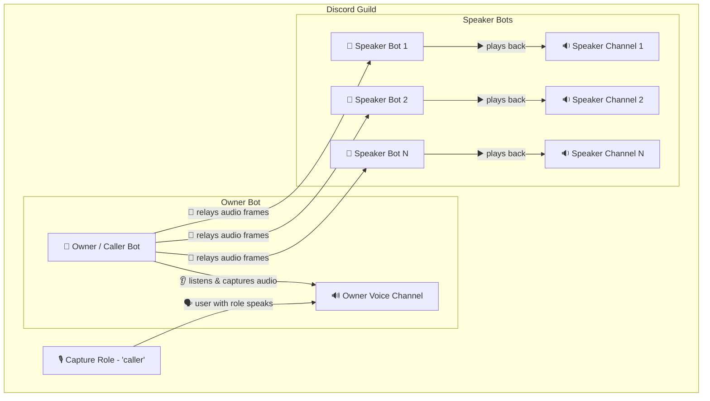
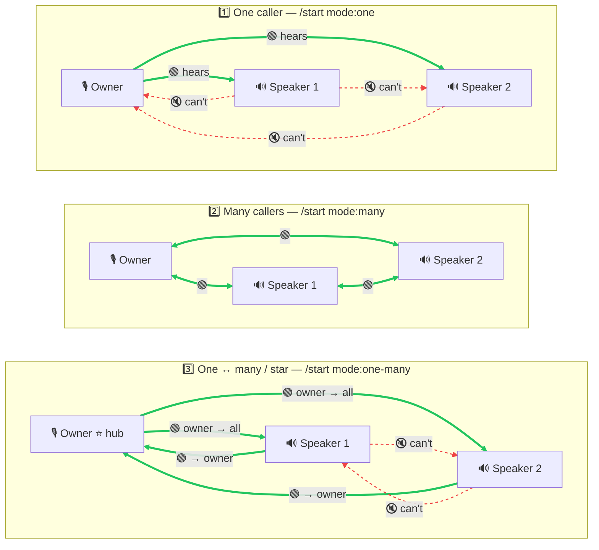

# Free, Self-Hosted Discord Shot Caller & Voice Relay Bot

**go-discord-caller** captures your **shot caller's** voice and **broadcasts it live to multiple speaker bots — across one or many Discord servers at once**. It supports single-caller broadcast, hub-and-spoke, and full multi-channel conference modes with mix-minus audio mixing and Discord's DAVE end-to-end encryption.

It is **100% free and open source** — you self-host it with your own bot tokens and own your data. No subscriptions, no per-server caps, no party limits.

[:material-discord: Try the hosted bot](https://discord.com/oauth2/authorize?client_id=1484911601210495038&scope=bot&permissions=391565762894144){ .md-button .md-button--primary }
[:material-github: View on GitHub](https://github.com/sealbro/go-discord-caller){ .md-button }
[Free vs paid shot-caller bots →](free-shot-caller-bot.md){ .md-button }

## Why use it

- **Free & open source (Apache-2.0)** — no monthly fee, no trial wall.
- **Unlimited servers & speakers** — inter-guild relay across any number of Discord servers; one speaker bot per voice channel, as many as you want.
- **Three caller modes** — one-caller broadcast, hub-and-spoke, or full conference with mix-minus echo prevention.
- **End-to-end encrypted audio** — uses Discord's DAVE E2EE voice protocol via [godave / libdave](https://github.com/disgoorg/godave).
- **Self-hosted & private** — runs in Docker; bindings persist in a YAML store you control.
- **Localized** — slash commands and setup UI in 7 languages (English, Español, Deutsch, Français, Português, Polski, Русский).

## How it works

One **owner / caller bot** listens in a voice channel and captures audio from users with a configured role, then fans it out to a pool of **speaker bots**, each playing back in its own channel — in the same server or in allied servers via a relay code.



See the [detailed voice flow](https://github.com/sealbro/go-discord-caller/blob/main/docs/VOICE_FLOW.md) and [end-to-end latency breakdown](https://github.com/sealbro/go-discord-caller/blob/main/docs/LATENCY.md).

## Caller modes

Who hears who depends on the mode (🟢 solid = can hear, 🔇 red dashed = cannot hear).



- **1️⃣ One caller** — the owner talks, speakers only listen and can't talk back.
- **2️⃣ Many callers** — full conference: everyone hears everyone (mix-minus echo prevention).
- **3️⃣ One ↔ many / star** — the owner is the hub: it hears all speakers, but each speaker only hears the owner, not each other.

## Quick start (Docker)

```bash
docker run -d \
  -e DISCORD_OWNER_BOT_TOKEN=your-owner-token \
  -e DISCORD_SPEAKER_BOT_TOKEN_1=your-speaker-1-token \
  -e STORE_PATH=/data/store.yaml \
  -v $(pwd)/data:/data \
  sealbro/go-discord-caller
```

Then run `/setup` in your server to bind the capture role, manager role, owner channel, and speaker bots — no config files needed. Full instructions are in the [README on GitHub](https://github.com/sealbro/go-discord-caller#discord-app-setup).

## Built for gaming guilds

Your shot caller speaks once and every squad hears the call instantly — no repeating yourself across channels. It's tactical voice communication and multi-squad coordination for **PvP battles, guild wars, sieges, node wars, and competitive raids**, with cross-server voice relay to unite allied guilds under a single command.

## Works with your favorite games

A game-agnostic Discord voice command system — it works for any guild on any title, including **Throne and Liberty, World of Warcraft, Guild Wars 2, Black Desert Online, Albion Online, New World, and EVE Online**.

## Use cases

- **Gaming guilds & alliances** — a shot caller's voice reaches every squad channel across allied servers during raids, sieges, node wars, and PvP.
- **Events & town halls** — broadcast one speaker to many listening rooms.
- **Cross-community relays** — link two or more Discord servers under a single voice command with a shared relay code.

## Learn more

- [How it works — voice flow diagrams](https://github.com/sealbro/go-discord-caller/blob/main/docs/VOICE_FLOW.md)
- [Free shot-caller bot vs paid services](free-shot-caller-bot.md)
- [Building a Discord Caller (Voice Relay) Bot in Go](https://dev.to/sealbro/building-a-discord-caller-voice-relay-bot-in-go-5b9h)
- [Source code on GitHub](https://github.com/sealbro/go-discord-caller)
